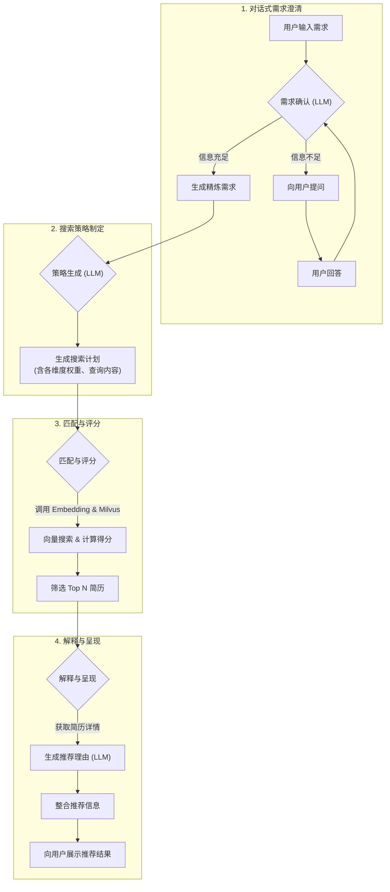

传统招聘流程中存在几个显著痛点：简历筛选耗时费力，关键词匹配可能会错过那些表达方式不同但同样有潜力的候选人，而我们有时会不自觉地过度依赖学历、学校或大厂背景等"硬标签"，忽视了候选人真实的技能水平和经验深度。

大语言模型的出现为我们带来了全新视角。它强大的自然语言理解能力不仅能"看到"文字，更能"理解"文字背后的含义。那么，我们能否利用这种能力，打造一个真正懂"人"的推荐系统——一个能深入理解候选人能力和岗位实际需求的系统？

正是这个想法促使我开始实践。本文将从我的视角，分享构建这个系统原型过程中的思考、挑战和核心设计逻辑。希望能为正在探索如何用 AI 赋能人力资源管理的朋友们带来一些启发。

整个系统的目标是：**通过与用户（通常是招聘经理或 HR）的自然语言对话，理解招聘需求，智能地在简历库中进行语义匹配，最终推荐出最合适的候选人，并给出清晰的推荐理由。**

### **系统整体流程与核心思路**

在深入技术细节之前，让我们通过一个流程图来了解系统的整体运作方式：

**与传统方法的关键不同：**

传统的简历筛选或推荐主要依赖表层信息处理：

-   **关键词搜索：** 仅做岗位名称的直接匹配，容易因表述差异而遗漏合适人选或产生误判。
-   **标签筛选：** 局限于职位类别、行业、学历、工作年限等预设标签，无法准确评估实际经验与岗位的匹配程度。
-   **缺乏深度解读：** 传统系统无法理解简历中工作职责、项目细节、成果等非结构化文本的**内在含义**。

而本次探索的核心思路是**运用大模型和向量技术，深入解读简历内容进行智能匹配**：

1.  **理解真实需求：** 通过 LLM 对话，将模糊需求转化为精准的描述性招聘画像。
2.  **理解简历内容：** 利用 Embedding 技术，将简历各部分（工作经历、项目经验、技能描述、个人总结等）转换为语义向量。
3.  **语义匹配代替字面匹配：** 在向量空间中比较招聘需求与简历内容的**语义相似度**，即使表述不同，相似的核心经验或技能也能被准确识别。
4.  **定制化多维度评估：** 这是一个重要突破。系统**不只是简单打分，而是根据职位特点动态调整搜索和评分重点**。通过在搜索阶段**突出**关键需求，使最终得分更准确反映简历与**特定岗位**的匹配度，实现了千人千面的定制化推荐。

简而言之，我们让机器像资深招聘专家一样，深入"阅读"和"理解"简历与需求，基于**真实能力和经验**进行**个性化**匹配，而非仅依赖表面标签和关键词。

下面，我们按流程详细展开。

### 一、澄清需求：对话式理解

**挑战：** 招聘需求的初始描述通常是模糊、不完整且口语化的。直接用这样的输入去检索显然效果不佳。因此，我们需要一个机制来"翻译"和"完善"用户的真实意图。

**解决方案：** 我设计了一个基于 LLM 的需求确认模块。它就像一位经验丰富的招聘顾问，通过对话逐步澄清和细化需求。

**实现逻辑：**

1.  **初步分析：** 当用户输入第一段需求描述时（如"我需要一个熟悉 Python 和机器学习的高级数据科学家，最好有金融行业背景"），LLM 会分析这段话，提取关键信息维度，包括工作经历（职位、年限）、技能（Python、ML）、行业背景（金融）和教育背景等。
2.  **完整性评估：** LLM 会根据预设的"关键维度 checklist"判断当前信息是否足够支撑有效搜索。例如，一个有效的需求至少应涵盖职位、核心技能和大致经验水平这三个方面。
    -   **信息充足：** 若 LLM 判断信息已较完整，它会运用语言组织能力，将用户输入和历史对话整合成一段**流畅、自然、结构化**的招聘需求描述。这里强调生成自然的描述性文本，而非生硬的字段列表，以更好地支持后续的语义理解。
    -   **信息不足：** 若 LLM 发现缺少关键信息（如仅说"招个 Python 工程师"，未提经验要求或具体职责），它会生成**简洁、有针对性**的问题引导用户补充。例如："好的，您期望这位 Python 工程师有多少年工作经验？主要负责哪些工作？"关键是一次性询问所有缺失信息，避免反复对话。
3.  **迭代完善：** 用户回答后，LLM 会结合新信息再次分析和评估，直到达到"信息充足"状态。

**关键考量：**

-   **Prompt 设计至关重要：** System Prompt 需清晰指导 LLM 如何分析、判断完整性、提问和总结。尤其要强调生成自然语言描述，而非格式化列表。
-   **平衡交互效率与信息完整度：** 目标是用最少的交互获取足够精确的信息。提问要精准，避免模糊的开放式问题。
-   **状态管理：** 通过状态标识（如“已就绪”或“需更多信息”）来驱动整个流程的转换是关键。

通过这个对话式的需求确认过程，我们获得了一份经 LLM"精炼"的、完整而清晰的招聘需求描述。这是后续所有步骤的基石。

### 二、制定策略：规划搜索蓝图

**挑战：** 有了精炼的需求描述后，如何将其有效地"翻译"给向量数据库？简历数据包含多个维度（工作经历、教育背景、技能、项目经验、个人总结等），而不同维度对不同岗位的重要性各异。直接用整个需求描述进行单一的向量搜索，效果往往不尽理想。

**解决方案：** 我设计了一个**两阶段**的搜索策略生成机制，同样由 LLM 驱动。

#### **阶段一：设定整体优先级**

**目标：** 确定哪些简历信息维度（对应数据库中的不同信息集合）与当前招聘需求最相关，并为它们分配权重。

**实现逻辑：**

1.  **输入：** 精炼后的招聘需求描述。
2.  **LLM 分析：** LLM 读取需求描述，并结合预先定义的可用信息维度列表及其描述（如“工作经历”包含岗位和职责，“技能”包含技能标签等）。
3.  **相关性评估与权重分配：** LLM 的任务是输出一个包含信息维度名称及其重要性分数的列表。
    -   LLM 需要判断需求描述中的重点主要对应哪些维度。例如，若需求强调"5年后端开发经验，精通 Java 和 Spring Boot"，那么“工作经历”和“技能”的权重应较高。如果还提到"计算机硕士学历"，“教育背景”也应获得相应权重。
    -   所有维度的重要性分数之和必须为 1。这要求 LLM 不仅要识别相关性，还要进行相对重要性的判断和量化。

**关键考量：**

-   **Prompt 指导原则：** 需要明确指导 LLM 如何权衡不同维度。例如：优先考虑工作经历；识别核心需求与辅助需求；考虑隐含需求；考虑向量匹配的有效性。
-   **输出格式约束：** 严格要求 LLM 输出预定义的结构，确保下游处理的稳定性。

这一步完成后，我们就有了一个高层次的指导方针：确定了对这个职位而言，应重点关注哪些方面的信息，以及各自的权重比例。

#### **阶段二：制定详细搜索方案**

**目标：** 针对第一阶段确定的每个相关信息维度，生成具体、可执行的向量搜索查询。

**实现逻辑：**

1.  **输入：** 精炼后的招聘需求描述，以及第一阶段生成的某个信息维度的名称和权重。
2.  **LLM 分析（针对性）：** LLM 此时的任务更加聚焦。它需要分析需求描述中与当前维度相关的内容，并为该维度内的**每个具体方面**（如“工作经历”维度可能包含“职位名称”和“职责描述”两个方面）生成一个或多个具体的搜索查询策略。
3.  **生成查询文本：** 这是最关键的步骤。LLM 需要根据每个方面的特性，生成用于计算 embedding 的文本。
    -   **遵循特定指南：** 为每个维度的每个方面都设计了详细的生成指南。例如：对于“职位名称”，查询文本应是精炼的岗位名称，若涉及多个相似岗位则生成多个独立查询；对于“职责描述”，查询文本应是一段不少于 100 字的详尽描述，若用户输入不足则需 LLM 进行合理扩展；对于“技能”，查询文本应是具体技能名，并限制数量。
    -   **招聘者视角：** Prompt 中强调要求 LLM "站在招聘者角度思考"，设计出最有可能匹配到目标候选人的查询文本。
    -   **英文要求：** 由于所选用的 embedding 模型对英文处理效果更佳，这里特别要求 LLM 生成的查询文本**必须是英文**。
4.  **分配内部权重：** 对于同一个信息维度内生成的多个查询（可能针对不同方面，或同一方面的不同内容），LLM 需要为它们分配相对重要性分数，总和为 1。

**关键考量：**

-   **精细的 Prompt Engineering：** 需要为不同维度、不同方面提供差异化且操作性强的指令。
-   **LLM 的"模拟"与"创造"能力：** 利用 LLM 在信息不足时，基于行业知识"模拟"出更完整的描述。
-   **权衡查询数量与效率：** 需要找到查询数量和计算效率的最佳平衡点。
-   **并发处理：** 各维度的详细策略生成可并发处理以提升效率。

通过这两阶段的策略生成，我们最终得到了一套结构化的搜索指令：明确了要搜索哪些信息维度，使用哪些具体文本去搜索哪些方面，以及每个查询的重要程度。这套完整的指令为下一阶段的向量搜索奠定了坚实基础。

### 三、执行匹配：搜索与评分

**挑战：** 我们已获得精炼的需求描述和对应的多维度查询意图向量。现在的关键问题是：如何在海量简历向量库中高效找到匹配项，并计算出一个能全面反映匹配程度的综合分数？

**解决方案：** 核心在于执行向量搜索，并设计合理的评分机制整合搜索结果。这套评分机制需要准确体现我们在策略阶段对各需求维度重要性的判断。

**实现逻辑：**

1.  **执行向量搜索：**
    -   评分模块利用策略阶段生成的查询向量，在向量数据库中搜索相应简历信息集合（如工作经历、技能等）。
    -   对每个查询向量，数据库返回语义相近的简历片段向量及相似度得分。系统通过阈值过滤掉低分和不相关匹配。
2.  **聚合初步匹配得分：**
    -   由于一份简历可能在多个维度与查询意图产生语义匹配，因此会获得多个相似度得分。
    -   系统首先收集同一简历在同一信息维度（如工作经历描述）上的所有有效匹配得分。
3.  **计算"维度内部"得分：**
    -   将同一维度的多个相似度得分合并为一个代表性分数。可采用不同合并策略（如取最高分、混合策略等）来反映匹配的深度和广度。
    -   **应用内部权重：** 将"维度得分"乘以该维度（方面）在详细策略中的相对重要性权重。
4.  **计算最终简历总分：**
    -   **体现定制化：** 这是评分过程的核心，也是实现**定制化检索效果**的关键。简历的最终得分是各相关维度（工作经历、技能、教育等）加权得分的总和。
    -   汇总各维度经步骤 3 计算得到的加权得分。
    -   在汇总时，每个维度得分还要乘以其在**整体策略**中的全局重要性权重。
    -   **两层权重体系（方面内权重和维度间权重）使系统能根据不同招聘需求灵活调整评估重点。** 例如，对特定技术栈要求极高的职位（高“技能”权重），即使两份简历工作经验相似，技能匹配度更高的简历也会在最终得分上占优。
    -   将所有维度的双重加权得分相加，得到最终的综合匹配分数。
5.  **排序生成推荐列表：**
    -   按最终得分降序排列所有简历，选取 Top N 作为初步推荐结果。

**评分逻辑的核心与优化思考：**

-   **权重驱动的定制化：** 评分机制通过两层权重体系，将 LLM 对需求重要性的理解量化并应用到最终得分计算中，使评分过程能动态适应不同职位要求。
-   **当前方法的局限：** 目前的得分合并策略和权重数值主要基于经验规则，虽然直观，但最优性尚待验证。
-   **基于反馈的评分模型优化：** 更理想的进阶方向是引入机器学习，通过用户反馈训练排序模型，自动学习各特征的最佳组合方式，实现数据驱动的精准定制化排序。

通过这套评分流程，我们获得了一个能综合反映简历与需求在语义层面、多维度匹配程度的量化分数，并准确体现了职位特定需求的侧重点。

### 四、结果呈现：解释与交付

**挑战：** 单纯的排序列表无法满足需求。招聘者需要了解推荐这些候选人的具体原因，并希望以清晰的方式查看关键信息。

**解决方案：**

1.  **生成推荐理由：** 利用 LLM 为 Top N 简历生成推荐理由。
    -   **输入：** 原始需求、简历评分详情、简历关键内容摘要。
    -   **输出：** 生成客观、简洁的推荐说明，直接阐述简历与需求的匹配点。在 Prompt 设计中强调客观性、简洁性和隐私保护，并明确要求解释匹配原因。
2.  **整合呈现：** 将 Top N 简历的评分、关键信息（个人特征、经验概述、技能概览）和推荐理由进行整合。
    -   通过清晰易懂的格式（如前端界面上的信息卡片）呈现给用户，便于快速评估和决策。

**关键考量：**

-   **推荐理由的价值：** 这是提升系统透明度和用户信任的关键。有效的推荐理由能帮助招聘者快速把握候选人亮点，理解系统的推荐逻辑。
-   **信息呈现的清晰度：** 为了有效辅助决策，信息的组织方式和详略程度至关重要。需要突出核心匹配点，同时提供必要的背景信息。

### 五、回顾与思考：从"标签"到"能力"的转变

这次构建智能简历推荐系统原型的探索，清晰地展示了大语言模型（LLM）在改进人力资源实践方面的潜力，尤其是在人才匹配这个核心环节。它验证了一个重要可能：我们能够从依赖表面的关键词和标签，转向更深层次地理解候选人的能力与经验。

**实践中的几个关键体会：**

1.  **语义理解是核心突破点：** LLM 最大的优势在于"读懂"自然语言描述。它能理解简历和招聘需求中不同表达方式背后的共同含义，捕捉技能熟练程度、经验性质等细微差别，这是传统关键词匹配无法企及的。这大幅提升了匹配精准度，有效减少了人才筛选中的遗漏。
2.  **实现从"标签匹配"到"能力匹配"：** 传统方法过度依赖学历、公司背景等硬性标签。通过分析简历中的实际工作内容和项目描述，我们能更准确地评估候选人的技能应用、职责范围和解决问题的经验是否真正契合岗位要求。这让评估更加公平，更聚焦于候选人的真实能力。
3.  **对话式交互更能捕捉真实需求：** 相比填写固定的筛选字段，通过与 LLM 的多轮对话来明确和细化需求显得更加自然。这种方式更容易发掘招聘经理未明确表达的关键期望，如对特定项目经验的偏好或某项软技能的要求，从而勾勒出更精准的招聘画像。
4.  **定制化匹配策略提升适用性：** 系统的突出优势在于其灵活性。通过 LLM 动态生成不同维度的权重，搜索和评分过程能**为每个职位量身定制**。技术岗位可以侧重技能和项目经验，管理岗位则更关注领导力相关描述。这种动态调整的能力确保了推荐结果与具体需求的高度关联。
5.  **可解释性助力实践效果：** 系统不只提供推荐结果，还会解释推荐理由。当收到不符预期的推荐时，清晰的解释能帮助用户优化需求描述。这种透明度提升了招聘过程的可控性和推荐结果的可信度。

**未来值得探索的方向：**

-   **提升匹配精度：** 持续优化 Prompt 设计，探索更有效的评分逻辑，引入复杂特征组合，针对性地微调 Embedding 模型以加强对行业术语和技能描述的理解。
-   **构建反馈闭环：** 设计便捷的推荐结果评价机制（包括"符合要求"、"不符合"、"理由不当"等选项）。利用这些反馈数据自动调整搜索策略和评分权重，甚至重新训练排序模型，实现系统的持续进化。
-   **拓展至更多场景：** 将系统应用于企业内部人才搜索和推荐，助力发现合适的内部人选，促进人才流动与发展，提升人才资源利用效率。

总的来说，这次探索印证了利用 LLM 进行语义理解，以此驱动人才匹配是可行的。这种方式让我们有机会真正深入简历内容，依据候选人的实际技能和经验进行筛选，而不只是停留在关键词或预设标签层面。实践中，**按需定制**的搜索策略和**可解释**的推荐理由，不仅让匹配过程更贴合具体职位的需求，也为后续的调整和优化提供了明确的抓手。当然，要让这种方法在实际工作中发挥更大价值，还需要结合具体的人力资源业务场景，持续进行技术和应用的打磨。

以上就是我近期在这个小项目上的一些思考和实践分享。希望这些探索过程能给你带来一些参考。如果你对如何利用 AI 技术改进人才管理，或者对这个项目本身有任何想法，都非常欢迎一起交流。